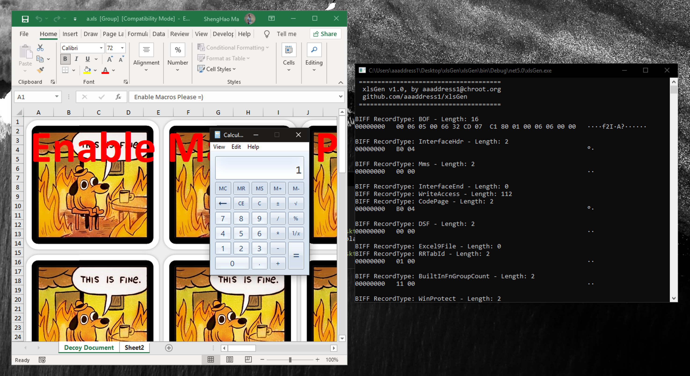

# xlsGen
Tiny Excel BIFF8 Generator, to Embedded 4.0 Macros in *.xls

this PoC is rewritten from the excellent project [Macrome](https://github.com/michaelweber/Macrome), because it's too large and not friendly for a beginner who want to know deeper inside the technique. I create a simple one PoC for learning & experiences.

## Reference 
1. https://malware.pizza/2020/05/12/evading-av-with-excel-macros-and-biff8-xls/amp/?__twitter_impression=true
2. https://github.com/michaelweber/Macrome
3. https://github.com/outflanknl/EvilClippy
